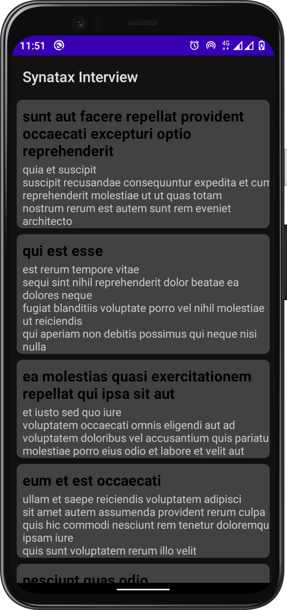
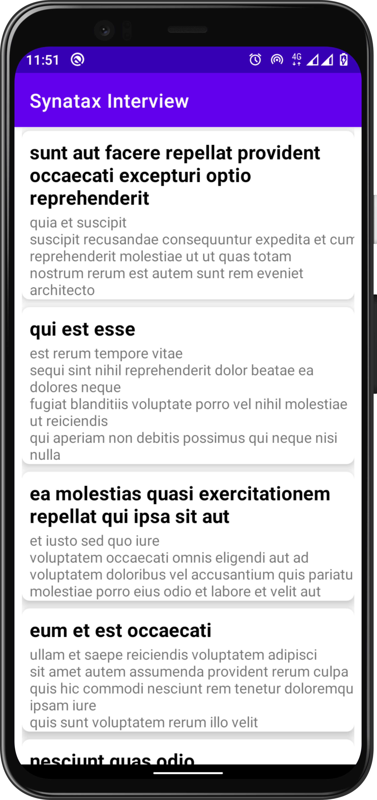

# SynataxInterview
 An android app for the Syntax Technical Interview consuming [PlaceHolder API]("https://jsonplaceholder.typicode.com/") to display a list of [Posts]("https://jsonplaceholder.typicode.com/posts")
 It has been built using MVVM Architecture as well as Jetpack Components.

 ## Table of Contents

- [Libraries](#libraries)
- [Screenshots](#screenshots)

## Libraries.
- [Hilt](https://github.com/google/hilt) - Dependency Injection library.
- [Jetpack](https://developer.android.com/jetpack)
  - [Viewmodel](https://developer.android.com/topic/libraries/architecture/viewmodel) - Manage UI related data in a lifecycle conscious way .
  - [Data Binding](https://developer.android.com/topic/libraries/data-binding) - Support library that allows binding of UI components in  layouts to data sources.
- [Room]() - Provides an abstraction layer over SQLite used for offline data caching.
- [Retrofit](https://square.github.io/retrofit/) - Type-safe http client 
and supports coroutines out of the box.  
- [GSON](https://github.com/square/gson) - JSON Parser,used to parse 
requests on the data layer for Entities and understands Kotlin non-nullable 
and default parameters.
- [OkHttp-Logging-Interceptor](https://github.com/square/okhttp/blob/master/okhttp-logging-interceptor/README.md) - Logs HTTP request and response data.
- [kotlinx.coroutines](https://github.com/Kotlin/kotlinx.coroutines) - Library Support for coroutines.
- [Material Design](https://material.io/develop/android/docs/getting-started/) - Build awesome beautiful UIs.

## Screenshots.

  